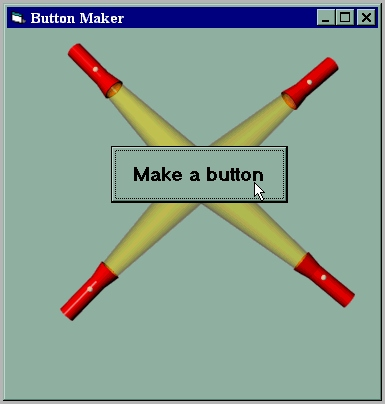



## ButtonMaker

### Description

This simple program allows you to create a button, change it's size,position, font, text, color, and then it lets you choose an action that takes place when the button is clicked. This program is not very advanced, but I am planning to make a better version of it in the near future.
 
### More Info
 
Please extract the source code before using it!

             |
---                |---
**Submitted On**   |2001-08-24 20:51:38
**By**             |[Leonid  Etkin](https://github.com/Planet-Source-Code/PSCIndex/blob/master/ByAuthor/leonid-etkin.md)
**Level**          |Beginner
**User Rating**    |4.0 (8 globes from 2 users)
**Compatibility**  |VB 5\.0
**Category**       |[Graphics](https://github.com/Planet-Source-Code/PSCIndex/blob/master/ByCategory/graphics__1-46.md)
**World**          |[Visual Basic](https://github.com/Planet-Source-Code/PSCIndex/blob/master/ByWorld/visual-basic.md)
**Archive File**   |[ButtonMake252978242001\.zip](https://github.com/Planet-Source-Code/leonid-etkin-buttonmaker__1-26623/archive/master.zip)

